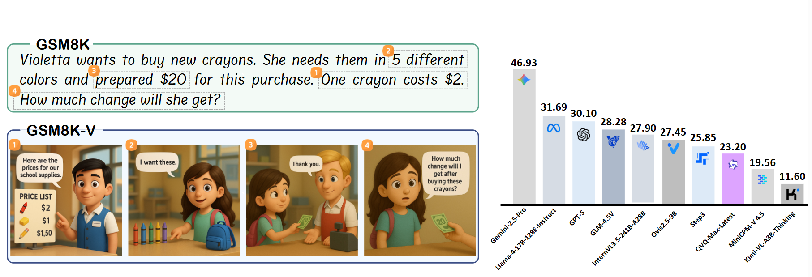
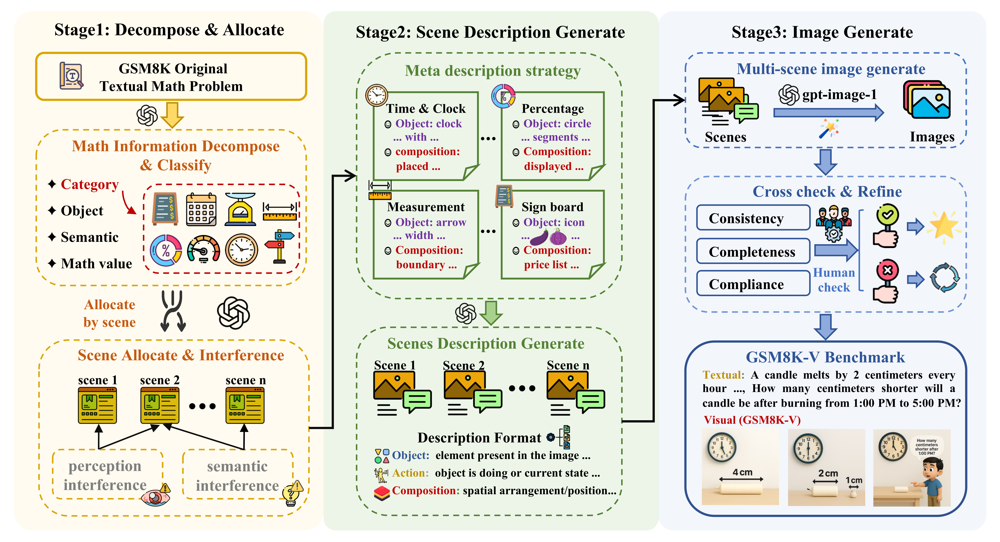
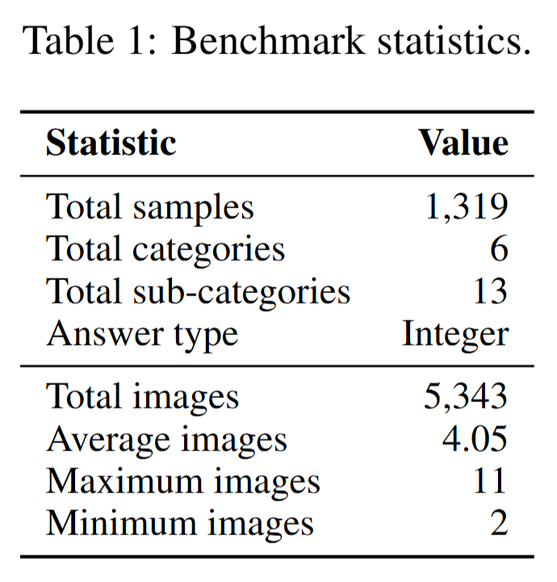
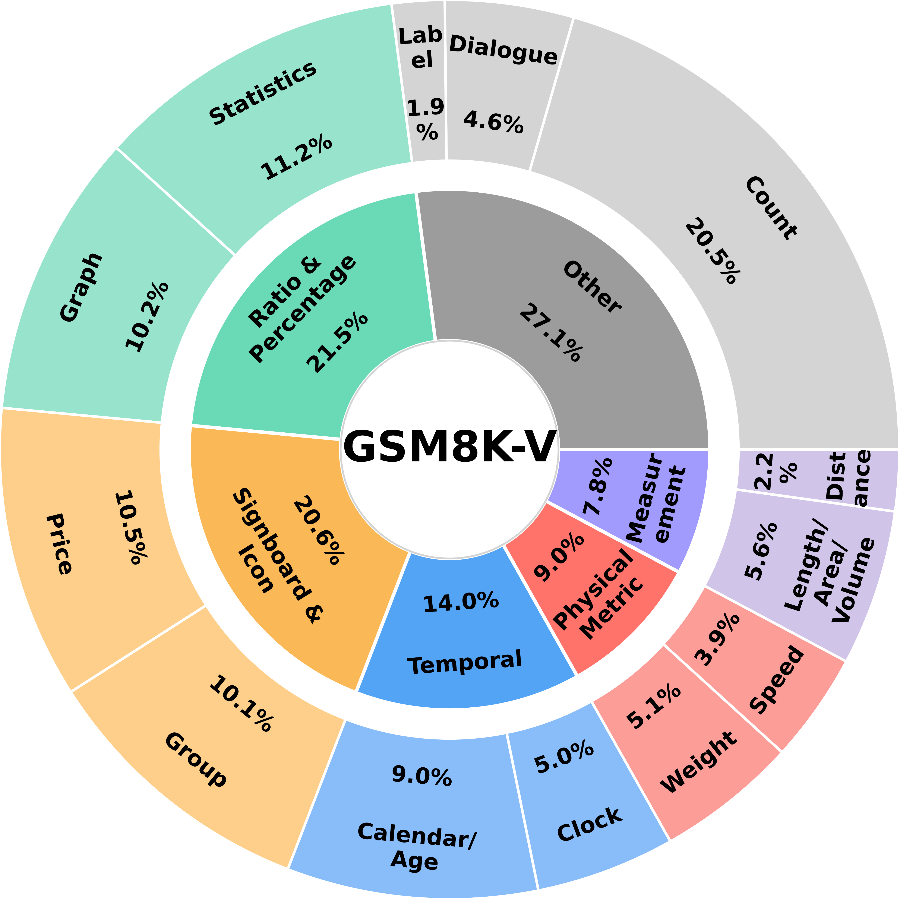
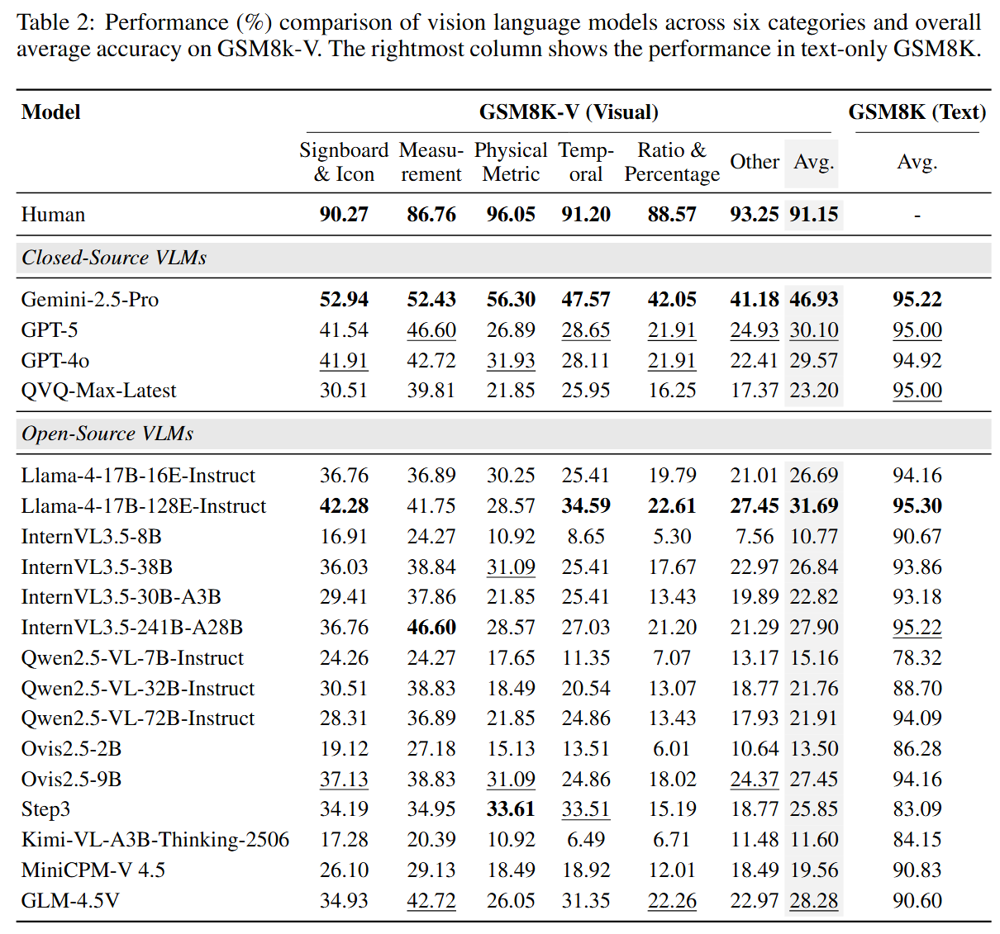

<div align="center">


<h1>GSM8K-V: Can Vision Language Models Solve Grade School Math Word Problems in Visual Contexts?</h1>

</div>

<br>

<div align="center">

[Fan Yuan](mailto:yuanfan7777777@gmail.com)<sup>1,\*</sup>,
[Yuchen Yan](mailto:yanyuchen@zju.edu.cn)<sup>1,\*</sup>,
Yifan Jiang<sup>1</sup>,
Haoran Zhao<sup>1</sup>,
Tao Feng<sup>1</sup>,
Jinyan Chen<sup>1</sup>,
Yanwei Lou<sup>1</sup>,
<br>
Wenqi Zhang<sup>1</sup>,
<strong>[Yongliang Shen]((mailto:syl@zju.edu.cn))<sup>1,†</sup></strong>,
Weiming Lu<sup>1</sup>,
Jun Xiao<sup>1</sup>,
Yueting Zhuang<sup>1</sup>

</div>


<p align="center">
  <sup>1</sup>Zhejiang University
  <br>
  <sup>*</sup>Equal contribution, <sup>†</sup>Corresponding author
</p>

<p align="center">
🤗 <a href="https://huggingface.co/datasets/ZJU-REAL/GSM8K-V">Dataset</a> |
 <a href="xx">Arxiv</a> 
| 📑 <a href="https://zju-real.github.io/GSM8K-V">ProjectPage</a> 
<br>
</p>

<p align="center">
  
</p>


## 🔔 News
- 🔥 **2025.09.28:** Code for evaluation is available! 🚀
- 🔥 **2025.09.28:** Home page is available. 🌟

## 👁️ Overview 




**GSM8K-V** is a purely visual multi-image mathematical reasoning benchmark that systematically maps each GSM8K math word problem into its visual counterpart to enable a clean, within-item comparison across modalities. Built via an automated pipeline that extracts and allocates problem information across scenes, generates scene-level descriptions, and renders images, coupled with meticulous human annotation, the benchmark comprises 1,319 high-quality multiscene problems (5,343 images) and addresses limitations of prior visual math evaluations that predominantly focus on geometry, seldom cover visualized word problems, and rarely test reasoning across multiple images with semantic dependencies. Evaluations of a broad range of open- and closed-source models reveal a substantial modality gap—for example, Gemini-2.5-Pro attains 95.22% accuracy on text-based GSM8K but only 46.93% on GSM8K-V—highlighting persistent challenges in understanding and reasoning over images in realistic scenarios and providing a foundation to guide the development of more robust and generalizable vision-language models.


## 🚀 Quick Start

```bash
# Clone the repository
git clone https://github.com/ZJU-REAL/GSM8K-V.git
cd GSM8K-V

# Create conda environment (optional)
conda create -n gsm8k-v python=3.10
conda activate gsm8k-v

# Install dependencies
pip install -r requirements.txt

# Command for vllm mode
python eval.py --type vllm \
  --model_name <eval_model_name> --api_base <vllm_api_base> \
  --concurrency <eval_parallel_num> --image_dir <data_path>

# Command for api mode
python eval.py --type api \
  --model_name <eval_model_name> --api_key <your_api_key> \ 
  --concurrency <eval_parallel_num> --image_dir <data_path>
```

## 📊 Benchmark Statistics

<p align="center">
  
  
</p>


## 📈 Main Results

<p align="center">
  
</p>

## ⚙️ Advanced Configuration Options

```bash
# Limit number of samples
python eval.py --num-samples 5

# Specify evaluation modes
python eval.py --modes text_only visual scene

# Specify prompt modes for visual evaluation
python eval.py --prompt-modes implicit explicit

# Evaluate only specific categories
python eval.py --data-categories measurement physical_metric

# Evaluate specific subcategories
python eval.py --data-subcategories distance speed weight

# Example Use
# ---- vllm start ----
vllm serve model/internvl3_5-8b \
  --port 8010 \
  --tensor-parallel-size 4 \
  --gpu-memory-utilization 0.9 \
  --max-model-len 8192 \
  --trust-remote-code \
  --served-model-name "internvl3.5-8b"

# ---- eval start ----
python eval.py --type vllm \
  --model_name internvl3.5-8b --api_base http://localhost:8010/v1 \
  --concurrency 32 --image_dir data/images

# For detailed help
python eval.py --help
```


## 📝 Citation

If you find our work helpful, feel free to give us a cite.

```
TBD
```

## ✉️ Contact Us
If you have any questions, please contact us by email: 
yuanfan7777777@gmail.com
